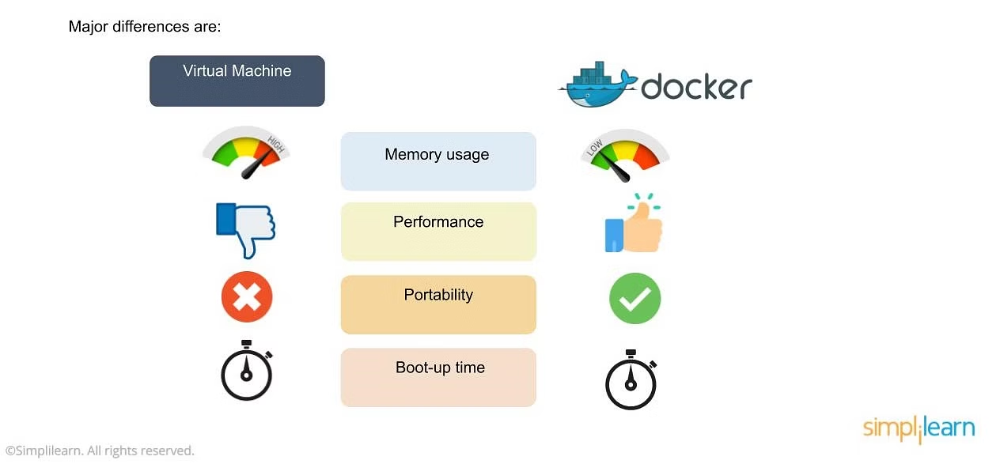
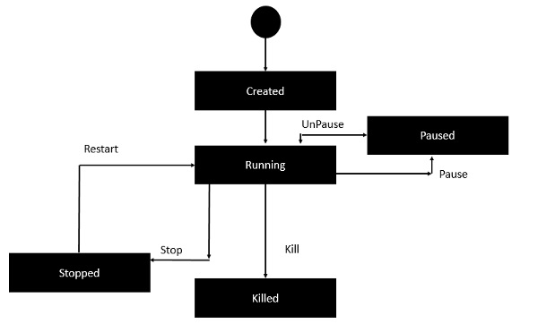

### Docker

Docker is an OS virtualized software platform that allows IT organizations to quickly create, deploy, and run applications in Docker containers, which have all the dependencies within them. The container itself is a very lightweight package with all the instructions and dependencies—such as frameworks, libraries, and bins—within it.

Also See: [NVIDIA-DOCKER](https://github.com/NVIDIA/nvidia-docker?tab=readme-ov-file)

### Docker vs Virtual Machines



- Docker uses a Docker engine layer, unlike virtual environments with a hypervisor layer.
- Docker environments exhibit low memory usage compared to the high memory usage in virtual machines.
- Unlike virtual machines, Docker allows reallocating and reusing free memory across containers in the environment.
- Docker environments boast fast boot-up times, often taking milliseconds.
> Although Docker is good, we donot get compatibility issue in VM while we may get compatibility issue in docker image(below windows 10).

To ensure a clean installation, remove conflicting packages with the following command:

```bash
for pkg in docker.io docker-doc docker-compose docker-compose-v2 podman-docker containerd runc; do
  sudo apt-get remove $pkg;
done
```

For Ubuntu installation, use the following commands:

```bash
sudo apt-get install docker-ce docker-ce-cli containerd.io docker-buildx-plugin docker-compose-plugin
```

Alternatively, you can install from a package. Choose your Ubuntu version from https://download.docker.com/linux/ubuntu/dists/, navigate to `pool/stable/`, select the appropriate architecture, and download the `deb` files for Docker Engine, CLI, containerd, and Docker Compose packages. Then install them using:

```bash
sudo dpkg -i ./containerd.io_<version>_<arch>.deb \
  ./docker-ce_<version>_<arch>.deb \
  ./docker-ce-cli_<version>_<arch>.deb \
  ./docker-buildx-plugin_<version>_<arch>.deb \
  ./docker-compose-plugin_<version>_<arch>.deb
```

Verify a successful Docker installation by running:

```bash
sudo service docker start
sudo docker run hello-world
```
> For more info: Watch the official Docker for Requirements for installation of docker in windows(Initialize Virtualization)
### Tips for Windows Installation

If you have WSL (Windows Subsystem for Linux) configured on your Windows machine, you can directly install Docker without encountering any issues.

Here are the steps to ensure a smooth installation:

1. **Enable Virtualization in BIOS:**
   - **Works But Not Recommended**: Access the BIOS settings by pressing the appropriate key during the computer's boot process (e.g., F2 for Lenovo laptops). You may have to try multiple times(quite annoying).
   - **Recommended**: 
    - Go to Start, click on the power button, hold the "Shift" key, and click on "Restart."
    - In the troubleshooting options, select "Advanced options" and then choose "UEFI Firmware Settings."
    - Click "Restart" to boot directly into BIOS options.
    - Enable Virtulization for BIOS. (See option with Virtual or Virtualizaation behind your processor name(mostly))
    - Save the changes

2. **Enable Virtualization for Windows:**
   - Search for "Turn Windows features on or off" in the search bar.
   - Look for "Hyper-V" in the list and enable it.
   
3. **Install Docker:**
   - Proceed with Docker installation now that virtualization is enabled.

Following these steps ensures that your Windows environment is properly configured for Docker installation.
#### Container
A container is essentially a composition of images. When we consolidate all the images within a container, it is referred to as a Docker image. Running the Docker image initiates the application environment.

In docker, everything is based on Images. AN image is a combination of a file system and parameters.

| Docker Image                | Container                                      |
|-----------------------------|-------------------------------------------------|
| 1. Packaging or Artifact    | When a Docker Image is run, it becomes a container |
| 2. Moving or Sharing         | 2. Starting the application                              |
| -                           | 3. Running the container creates an isolated environment for the application | 

### Docker-Hub
Docker-Hub is a registry service on the cloud that allows us to upload our own Docker built images and download Docker images that are built by other communities. 

We can also upload to private registry, only a organization or team has access to.

To download the images from [Docker-Hub](https://hub.docker.com/). Pull the images for ubuntu
```bash
docker pull  jenkins/jenkins:lts
```
To run Jenkins,
```bash
sudo docker run -p 8080:8080 -p 5000:5000 jenkins/jenkins:lts
```
In the `docker run` command the `-p` flag is used to publish ports from the container to the host. The syntax for the `-p` flag is `-p host_port:container_port`.

In the case of `sudo docker run -p 8080:8080 -p 50000:50000 jenkins`, it is specifying two port mappings:

1. `-p 8080:8080`: This maps port 8080 on the host machine to port 8080 on the Jenkins container. This is typically the default port for accessing the Jenkins web interface.

2. `-p 50000:50000`: This maps port 50000 on the host machine to port 50000 on the Jenkins container. Port 50000 is often used for Jenkins agent communication.

So, both mappings are essential for properly exposing the necessary ports for Jenkins to function, both for accessing the web interface and for handling agent communication.

We can utilize the CentOS image from Docker Hub to execute CentOS on our Ubuntu machine.

```bash
sudo docker run -it centos /bin/bash
```

First, it searches for the CentOS image locally; if not found, it downloads it from Docker Hub and installs it on our machine. 
- The `-it` flag is used to specify interactive mode.
- `-d` flag is used to run the container in detached mode. This is so that the container can run in the background.
- `/bin/bash` is used to run the Bash shell once CentOS is set up and running.

### Docker LifeCycle

Docker's `pause` and `stop` commands perform the same task. When using `pause`, CPU resources are freed, but memory is still retained. On the other hand, `stop` releases both memory and CPU usage. The memory is stored in cache on the disk.
### Docker commands
| Command                   | Description                                                                                            |
| ------------------------- | ------------------------------------------------------------------------------------------------------ |
| `docker -v`               | Returns the version of Docker.                                                                        |
| `docker image`            | Lists Docker images on the system. Returns:                                                          |
|                           | - TAG: Locally tags images (version)                                                                 |
|                           | - ImageID: Uniquely identifies the image                                                              |
|                           | - Created: Number of days since the image was created                                                |
|                           | - Virtual Size: Size of the image                                                                    |
| `docker images -q`        | Returns only the ImageIDs of the images.                                                              |
| `docker run <image>`      | Downloads Docker images from Docker Hub if not already present locally.                               |
| `docker rmi <ImageID>`    | Removes Docker images from the system.                                                                |
| `docker inspect <Repo>`   | Shows details of an image or container.                                                              |
| `docker run -it <Image>`  | Runs the image in interactive mode.                                                                  |
| `docker ps`               | Lists all currently running containers.                                                              |
| `docker ps -a`            | Lists all containers on the system.                                                                  |
| `docker history <Image>`  | Lists all commands run against an image via a container.                                              |
| `docker top <Container>`  | Shows the top-level processes within a container.                                                    |
| `docker stop <Container>` | Stops a running container.                                                                           |
| `docker rm <Container>`   | Deletes a container. Returns the ID of the removed container.                                         |
| `docker stats <Container>`| Shows CPU and Memory utilization of the container.                                                   |
| `docker attach <Container>`| Attaches terminal's standard input, output, and error to a running container using its ID or name.  |
| `docker pause <Container>` | Pauses processes in a running container.                                                             |
| `docker unpause <Container>`| Unpauses processes in a running container. Returns ContainerID of the unpaused container.           |
| `docker kill <Container>` | Kills the container or process with an option to specify a timeout (`-t`) in a running container.   |
| `service docker stop`      | Stops the Docker daemon process. Shows a message indicating the Docker process has stopped.           |
| `service docker start`     | Starts the Docker daemon process. Shows a message indicating the Docker process has started.         |


| Command                                      | Description                                                                   |
|----------------------------------------------|-------------------------------------------------------------------------------|
| `docker info`                                | Provides all relevant information on the Docker components installed.         |
| `docker login -u <username>`                | Sign in to Docker Hub.                                                        |
| `docker tag <Imagename> <username>/<ImageName>` | Tag the image to a Docker repository.                                        |
| `docker push <username>/<ImageName>`        | Push Docker image to Docker Hub.                                              |
| `docker exec [OPTIONS] <containerID> COMMAND [ARG...]` | Execute a command inside a running Docker container.                  |
| `docker exec -it <containerID> /bin/bash`   | Run a shell inside a running container.                                      |
| `docker volume create <volume-name>`        | Create a volume.                                                              |
| `docker volume inspect <volume-name>`       | View metadata, location, and details of a volume on disk.                     |
| `docker network create <network-app>`       | Create a Docker network.                                                      |
| `docker logs -f <container-id>`              | View logs of the container.                                                   |
| `docker compose up -d`                       | Start up the application stack; `-d` flag runs everything in the background. |
| `docker compose logs -f`                     | View logs from each service interleaved into a single stream.                 |
| `docker compose logs -f app`                 | View logs for a specific service (replace `app` with service name).           |
| `docker compose down`                        | Tear down all services; network will be removed, but named volumes persist.    |
| `docker compose down --volumes`              | Tear down everything, including volumes.                                      |
| `docker image history <ImageName>`          | View the layers in the created image.                                         |


#### DockerFile
Docker also provides you with the capability to create your own Docker images, which can be done using a `Dockerfile`.

```docker
# This is a comment
FROM ubuntu 
MAINTAINER real@sanjeev.com 

RUN apt-get update 
RUN apt-get install –y nginx 
CMD ["echo", "Image created"]
```

After creating the `Dockerfile`, we use `docker build` to build our own Docker images:

```bash
docker build -t ImageName:TagName dir
```

- `-t` is used to mention a tag for the image.
- `ImageName` is the name you want to give to your image.
- `TagName` is the tag you want to give to your image.
- `dir` is the directory where the Dockerfile is present.

When the building is successful, we can run `docker images`, and the image can be hosted on Docker Hub. 
Steps:
- Create a repositorty in Docker Hub
- Once it is created, make note of pull command and use `docker pull <your_repo>`
- tag your image to relevant directory

```
docker tag <imageID> <RepoName>:<version>
```
then push images to the DockerHub
```
docker push <RepoName>:<version>
```
### Docker in Private repo
1. Download the private registry using the Docker run command:

```bash
sudo docker run -d -p 5000:5000 --name registry registry:2
```

   - Note: This command maps the container's port 5000 to localhost:5000 and runs the container in detached mode.

2. Confirm that the registry container is running:

```bash
sudo docker ps
```

3. Tag an existing image for the private repository:

```bash
sudo docker tag <imageID> localhost:5000/centos
```

4. Push the tagged image to the private repository:

```bash
sudo docker push localhost:5000/centos
```

5. Delete local images and prepare to download from the private repository:

```bash
sudo docker rmi centos:latest
sudo docker rmi 67591570dd29
```

6. Pull the centos image from the private repository:

```bash
sudo docker pull localhost:5000/centos
```

### EntryPoint and CMD
In a Dockerfile, the `ENTRYPOINT` and `CMD` instructions are used to define the default behavior of a container when it starts.

1. **`ENTRYPOINT`:**
   - The `ENTRYPOINT` instruction specifies the command that will be run when the container starts. It sets the main executable or script, and any command-line arguments provided to `docker run` will be appended to the `ENTRYPOINT` command.
   - Example:
     ```Dockerfile
     FROM ubuntu
     ENTRYPOINT ["echo", "Hello"]
     ```
     When you run the container with `docker run myimage arg1 arg2`, it will execute `echo Hello arg1 arg2`.

2. **`CMD`:**
   - The `CMD` instruction provides default arguments for the `ENTRYPOINT` or the command to be executed if no `ENTRYPOINT` is specified. It can be overridden by providing command-line arguments to `docker run`.
   - Example:
     ```Dockerfile
     FROM ubuntu
     ENTRYPOINT ["echo"]
     CMD ["Hello", "world"]
     ```
     When you run the container without additional arguments (`docker run myimage`), it will execute `echo Hello world`.

   - Note: If the Dockerfile has both `ENTRYPOINT` and `CMD`, `CMD` provides default arguments to `ENTRYPOINT`.
