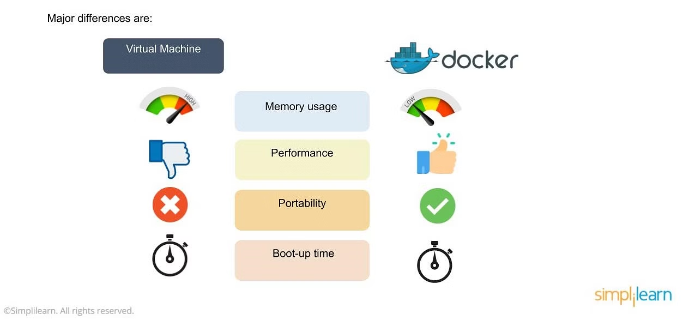

### Docker

Docker is an OS virtualized software platform that allows IT organizations to quickly create, deploy, and run applications in Docker containers, which have all the dependencies within them. The container itself is a very lightweight package with all the instructions and dependencies—such as frameworks, libraries, and bins—within it.

### Docker vs Virtual Machines



- Docker uses a Docker engine layer, unlike virtual environments with a hypervisor layer.
- Docker environments exhibit low memory usage compared to the high memory usage in virtual machines.
- Unlike virtual machines, Docker allows reallocating and reusing free memory across containers in the environment.
- Docker environments boast fast boot-up times, often taking milliseconds.
> Although Docker is good, we donot get compatibility issue in VM while we may get compatibility issue in docker image(below windows 10).

To ensure a clean installation, remove conflicting packages with the following command:

```bash
for pkg in docker.io docker-doc docker-compose docker-compose-v2 podman-docker containerd runc; do
  sudo apt-get remove $pkg;
done
```

For Ubuntu installation, use the following commands:

```bash
sudo apt-get install docker-ce docker-ce-cli containerd.io docker-buildx-plugin docker-compose-plugin
```

Alternatively, you can install from a package. Choose your Ubuntu version from https://download.docker.com/linux/ubuntu/dists/, navigate to `pool/stable/`, select the appropriate architecture, and download the `deb` files for Docker Engine, CLI, containerd, and Docker Compose packages. Then install them using:

```bash
sudo dpkg -i ./containerd.io_<version>_<arch>.deb \
  ./docker-ce_<version>_<arch>.deb \
  ./docker-ce-cli_<version>_<arch>.deb \
  ./docker-buildx-plugin_<version>_<arch>.deb \
  ./docker-compose-plugin_<version>_<arch>.deb
```

Verify a successful Docker installation by running:

```bash
sudo service docker start
sudo docker run hello-world
```
> For more info: Watch the official Docker for Requirements for installation of docker in windows(Initialize Virtualization)

#### Container
A container is essentially a composition of images. When we consolidate all the images within a container, it is referred to as a Docker image. Running the Docker image initiates the application environment.

In docker, everything is based on Images. AN image is a combination of a file system and parameters.

| Docker Image                | Container                                      |
|-----------------------------|-------------------------------------------------|
| 1. Packaging or Artifact    | When a Docker Image is run, it becomes a container |
| 2. Moving or Sharing         | 2. Starting the application                              |
| -                           | 3. Running the container creates an isolated environment for the application | 

### Docker-Hub
Docker-Hub is a registry service on the cloud that allows us to upload our own Docker built images and download Docker images that are built by other communities. 

We can also upload to preivate registry, only a organization or team has access to.

To download the images from [Docker-Hub](https://hub.docker.com/). Pull the images for ubuntu
```bash
docker pull  jenkins/jenkins:lts
```
To run Jenkins,
```bash
sudo docker run -p 8080:8080 -p 50000:50000 jenkins/jenkins:lts
```
In the `docker run` command the `-p` flag is used to publish ports from the container to the host. The syntax for the `-p` flag is `-p host_port:container_port`.

In the case of `sudo docker run -p 8080:8080 -p 50000:50000 jenkins`, it is specifying two port mappings:

1. `-p 8080:8080`: This maps port 8080 on the host machine to port 8080 on the Jenkins container. This is typically the default port for accessing the Jenkins web interface.

2. `-p 50000:50000`: This maps port 50000 on the host machine to port 50000 on the Jenkins container. Port 50000 is often used for Jenkins agent communication.

So, both mappings are essential for properly exposing the necessary ports for Jenkins to function, both for accessing the web interface and for handling agent communication.

### Docker commands
- `docker -v` -> return version of docker
- `d`