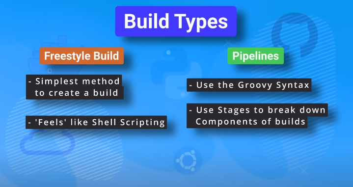

# Jenkins
Jenkins is a self-contained, open source automation server which can be used to automate all sort of tasks related to building, testing and delivering or deployinf software.

Jenkins can be installed through native system packages, Docker, or even run standalone by any machine with Java Runtime Environment(JRE) installed.
**Download and Run**
```bash
wget https://get.jenkins.io/war-stable/2.426.2/jenkins.war
java -jar jenkins.war --httpPort=8000
```
> Note for runnig Jenkins in GitHub Workspace(disable csrf verification (not recommended in production)): Go to /home/codespace/.jenkins -> Edit config.xml in line
```xml
<crumbIssuer class="hudson.security.csrf.DefaultCrumbIssuer">
    <excludeClientIPFromCrumb>false</excludeClientIPFromCrumb>
  </crumbIssuer>
```
To
```xml
<crumbIssuer class="hudson.security.csrf.DefaultCrumbIssuer">
    <excludeClientIPFromCrumb>true</excludeClientIPFromCrumb>
  </crumbIssuer>
```
## Jenkins Pipeline
Jenkins Pipeline is a plugin suite enabling the integration of continuous delivery pipelines into Jenkins. 

These pipelines automate the software delivery process from version control to end-users. Utilizing "as code" modeling, Jenkins Pipeline defines delivery pipelines through text files (`Jenkinsfile`) stored in a project's source control repository.


```groovy
pipeline {
    agent any

    stages {
        // Each stage represents a logical grouping of steps
        stage('Hello') {
            // Steps within a stage define the individual actions to be performed
            steps {
                // Each step represents a single execution unit
                echo 'Hello World'
            }
        }
    }
    // Post section can be used to define actions that should be executed after all stages, regardless of their success or failure
    post {
        // For example, you can archive artifacts or send notifications here
        success {
            echo 'Pipeline succeeded! Perform additional actions...'
        }
        failure {
            echo 'Pipeline failed! Take corrective actions...'
        }
    }
}
```

- The `pipeline` block defines the entire pipeline configuration.
- The `agent any` specifies that the pipeline can run on any available agent.
- The `stages` block organizes the pipeline into stages, and within each stage, the `steps` block defines the individual actions to be executed.
- There's a `post` section added to demonstrate how you can define actions to be executed after all stages, regardless of success or failure.

Jenkins pipelines are highly customizable, and you can add more stages, steps, and post actions based on your specific requirements. 

#### Timeout and retry
Jenkins offers robust steps that encapsulate other steps, addressing common issues such as retries (`retry`) until success or aborting if a step exceeds a specified duration (`timeout`). Given that running Jenkins processes consumes resources, it is advisable to utilize timeout wrapping for steps. This approach aids in code debugging and allows for job abortion if a specific step takes an excessive amount of time to execute.

### Jenkins Infrastructure

#### Master Server:
- Controls the Jenkins Pipeline.
- Schedules and manages builds.

#### Agents/Minions:
- Responsible for executing builds.

#### Workflow:

1. **Code Changes and Commit:**
   - Developers make changes in code and commit to the GitHub repository.

2. **Pipeline Trigger:**
   - The commit triggers the Jenkins pipeline on the Master Server.

3. **Agent Selection:**
   - The Master Server selects an agent based on configured labels for running the build.

### Agent Types

**Permanent Agents:**
- Dedicated servers exclusively for running jobs.
- Requires Java installation and configured SSH for secure connections.
- Build tools must be installed on the server.
- Can be a dedicated Windows or Linux machine.

**Cloud Agents:**
- Dynamic agents spawned on demand.
- Examples include Docker, Kubernetes, AWS Fleet Manager, etc.
- Offers flexibility and scalability by dynamically provisioning agents as needed.

### Build Types
- Freestyle Build
- Pipelines
