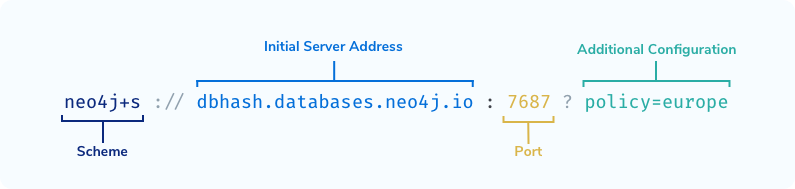

# Neo4j Applications with Python

Executing a Cypher statement against a Neo4j database requires the use of a thread-safe, application-wide fixture called a Driver.

The Driver object serves as the foundation for all Neo4j interactions and is topology independent, allowing the same code to run against a Neo4j cluster or a single DBMS.

It is recommended to create a single instance of the Driver in your application per Neo4j cluster or DBMS, which can be shared across the entire application.

## Installing the driver
```bash
pip install neo4j
```

## Creating a Driver Instance
A driver instance connects to one DBMS or Neo4j cluster, determined by the connection string provided.

The `neo4j` package exports a GraphDatabase object, offering a `driver()` function for creating a new driver instance.

The `driver()` function requires a mandatory parameter - a connection string for the Neo4j cluster or DBMS (e.g., `neo4j://localhost:7687` or `neo4j+s://dbhash.databases.neo4j.io:7687`), and an additional named parameter `auth` for Neo4j user credentials.

Here's an example of creating a driver instance to connect to a Neo4j instance on `localhost` with the username `neo4j` and password `neo`:

```python
# Import the neo4j dependency
from neo4j import GraphDatabase

# Create a new Driver instance
driver = GraphDatabase.driver("neo4j://localhost:7687",
    auth=("neo4j", "neo"))
```

### Verifying Connectivity
To ensure correct connection details, you can use the `verify_connectivity()` function. It raises a `Neo4jException` with the code property `Neo.ClientError.Security.Unauthorized` if a connection could not be made.

```python
# Verify the connection details
driver.verify_connectivity()
```

### Driver Instance Creation
```python
driver = GraphDatabase.driver(
  connectionString, // (1)
  auth=(username, password), // (2)
  **configuration // (3)
)
```
Arguments for `neo4j.driver()`:
1. Connection String: Comprising the scheme, server address, port number, and additional configuration.

> **WHICH SCHEME STRING IS RIGHT FOR YOU?**

> You can verify the encryption level of your DBMS by checking the `dbms.connector.bolt.enabled key` in `neo4j.conf`.

> If you are connecting to a DBMS hosted on Neo4j Aura, you will always use the `neo4j+s` scheme.
2. Authentication: Username/password authentication.
3. Additional Configuration (Optional): Allows advanced options like setting connection pool size or changing timeout limits.

```python
GraphDatabase.driver(uri, auth=auth,
    max_connection_lifetime=30 * 60,
    max_connection_pool_size=50,
    connection_acquisition_timeout=2 * 60)
```
### Managing Sessions and Transactions

*A session serves as a container for a series of transactions, utilizing connections from a pool as needed, offering a lightweight and disposable solution.*

It's crucial to note that sessions differ from database connections. When the Driver establishes a connection to the database, it opens up multiple connections for potential queries, and results may be received over these multiple connections.

Instead, sessions should be viewed as a client-side abstraction, grouping units of work while handling the underlying connections internally, not directly exposing them to the application.

To initiate a new session, use the `session()` method on the driver.

```python
with driver.session() as session:
```

The `session()` method also accepts an optional configuration argument. This argument allows you to specify the database against which queries should run in a multi-database setup and set the default access mode for transactions within the session.

```python
with driver.session(database="people") as session:
```

If no specific database is provided, the default database, configured in `neo4j.conf` under `dbms.default_database` (default: `neo4j`), will be used. It's important to note that creating multiple databases is not supported in Neo4j Aura or Neo4j Community Edition.

### Transactions in a Session

Transactions, executed through a Session, represent units of work performed against a database. They ensure coherent and reliable operations, independent of other transactions.

The driver exposes different types of transactions:

1. **Auto-commit Transactions:**
   Auto-commit transactions immediately execute a single unit of work against the DBMS and receive immediate acknowledgment. To run an auto-commit transaction, use the `run()` method on the session object.

    ```python
    session.run(
        "MATCH (p:Person {name: $name}) RETURN p",  # Query
        name="Tom Hanks"  # Named parameters referenced
    )
    ```

    **Note**: Auto-commit transactions should be used for one-off queries and are not suitable for production, especially in the presence of transient errors.

2. **Read Transactions:**
   For reading data from Neo4j, execute a Read Transaction. In a clustered environment, read queries are distributed across the cluster. Use the `execute_read()` function on the session, passing a function representing the unit of work.

    ```python
    def get_movies(tx, title):
        return tx.run("""
            MATCH (p:Person)-[:ACTED_IN]->(m:Movie)
            WHERE m.title = $title
            RETURN p.name AS name
            LIMIT 10
        """, title=title)

    # Execute get_movies within a Read Transaction
    session.execute_read(get_movies, title="Arthur")
    ```

    **Parameterized Queries**: Parameters in the Cypher statement should be passed as named parameters.

3. **Write Transactions:**
   For writing data to the database, execute a Write Transaction. In clustered environments, write queries are sent exclusively to the leader of the cluster.

    ```python
    # Define a unit of work to create a Person node
    def create_person(tx, name):
        return tx.run(
            "CREATE (p:Person {name: $name})",
            name=name
        )

    # Execute the create_person unit of work within a write transaction
    session.execute_write(create_person, name="Michael")
    ```

    In case of success, the transaction is automatically committed. If an issue arises, the transaction is rolled back, ensuring the database remains in its previous state. Unlike `session.run()`, transient errors trigger automatic retries by the driver.

<details>
<summary>Manually Creating Transactions</summary>

We can create a transaction object by calling the `begin_transaction()` function on the session. This method is different from the `execute_read` and `execute_write()` functions since, in this transaction, we have to manually commit by calling `tx.commit()` and rollback by calling `tx.rollback()`.

```python
with session.begin_transaction() as tx:
    # Run the query by calling `tx.run()`
    try:
        tx.run(query, **params)
        tx.commit()
    except:
        # If something goes wrong, then rollback the transaction
        tx.rollback()
```

</details>

### Close the Session

Once you have finished your session, you can call the `close()` method to release any database connections held by that session.

```python
# Close the session
session.close()
```

<details>
<summary>Python Types to Neo4j Types</summary>

| Python Type                  | Neo4j Cypher Type       | Notes                                |
|------------------------------|-------------------------|--------------------------------------|
| None                         | null                    |                                      |
| bool                         | Boolean                 |                                      |
| int                          | Integer                 |                                      |
| float                        | Float                   |                                      |
| str                          | String                  |                                      |
| bytearray                    | Bytes [1]               |                                      |
| list                         | List                    |                                      |
| dict                         | Map                     |                                      |
| neo4j.spatial.Point          | Point                   | See [Spatial Data Types](https://graphacademy.neo4j.com/courses/app-python/2-interacting/3-type-system/#_spatial_data_types)               |
| neo4j.spatial.CartesianPoint | Point (Cartesian)       | See [Spatial Data Types](https://graphacademy.neo4j.com/courses/app-python/2-interacting/3-type-system/#_spatial_data_types)               |
| neo4j.spatial.WGS84Point     | Point (WGS-84)          | See [Spatial Data Types](https://graphacademy.neo4j.com/courses/app-python/2-interacting/3-type-system/#_spatial_data_types)               |
| neo4j.graph.Node             | Node                    | See [Nodes & Relationships](https://graphacademy.neo4j.com/courses/app-python/2-interacting/3-type-system/#_nodes_relationships)            |
| neo4j.graph.Relationship     | Relationship            | See [Nodes & Relationships](https://graphacademy.neo4j.com/courses/app-python/2-interacting/3-type-system/#_nodes_relationships)            |
| neo4j.graph.Path             | Path                    | See [Nodes & Relationships](https://graphacademy.neo4j.com/courses/app-python/2-interacting/3-type-system/#_nodes_relationships)            |

</details>

<details>
<summary>Code to Get all movies</summary>
Code for all method in `api/dao/movies.py`.

```python
def all(self, sort, order, limit=6, skip=0, user_id=None):
    # define the unit of work
    def get_movies(tx, sort, orfer, limit, skip, user_id):
        cypher = """
        MATCH (m:Movie)
        WHERE m.`{0}` IS NOT NULL
        RETURN m {{ .* }} AS movie
        ORDER BY m.`{0}` {1}
        SKIP $skip
        LIMIT $limit
        """.format(sort, order)

        # run the statement within the transaction
        result = tx.run(cypher, limit=limit, skip=skip, user_id=user_id, sort=sort, order=order)

        # extract the list of Movies from the result
        return [row.value("movie") for row in result]
    
    with self.driver.session() as session:
        return session.execute_read(get_movies, sort, order, limit, skip, user_id)
```
Above Cypher query is a flexible way to retrieve movies from the graph database, allowing dynamic sorting, ordering, pagination, and filtering based on a specified property (`sort`). Explanation: 

1. **MATCH Clause:**
   ```
   MATCH (m:Movie)
   ```
   - The query starts with the `MATCH` clause, which specifies a pattern to match in the graph.
   - `(m:Movie)` matches nodes labeled as "Movie" and assigns the alias `m` to these nodes.

2. **WHERE Clause:**
   ```
   WHERE m.`{0}` IS NOT NULL
   ```
   - The `WHERE` clause filters the matched nodes based on a condition.
   - `{0}` is a placeholder that will be dynamically replaced by the `sort` parameter from the Python code.
   - This condition ensures that the property specified by `sort` is not NULL for the movies being considered.

3. **RETURN Clause:**
   ```
   RETURN m {.*} AS movie
   ```
   - The `RETURN` clause specifies what data to retrieve from the matched nodes.
   - `m {.*}` returns all properties of the `m` node.
   - It aliases the result as `movie`.

4. **ORDER BY Clause:**
   ```
   ORDER BY m.`{0}` {1}
   ```
   - The `ORDER BY` clause arranges the result set in a specified order.
   - `{0}` is a placeholder replaced by the `sort` parameter, and `{1}` is replaced by the `order` parameter from the Python code.
   - This orders the movies based on the specified property (`sort`) in the specified order (`order`).

5. **SKIP and LIMIT Clauses:**
   ```
   SKIP $skip
   LIMIT $limit
   ```
   - The `SKIP` and `LIMIT` clauses control pagination.
   - `$skip` and `$limit` are parameters that will be dynamically replaced by the `skip` and `limit` parameters from the Python code.
   - `SKIP` determines how many results to skip before starting to return data.
   - `LIMIT` restricts the number of results returned.
</details>

### Dealing with Errors

During the execution of a Cypher statement, various error scenarios and exceptions may arise. One type of error is transient, which could be resolved through retrying, as seen in situations like connecting to a database. Another type is permanent, such as syntax errors or constraint violations.

#### Types of Exceptions

- `neo4j.exceptions.Neo4jError`: Raised when the Cypher engine returns an error to the client.

- `neo4j.exceptions.ClientError`: Occurs when the client sends a faulty request, with possibilities including:

  - `neo4j.exceptions.CypherSyntaxError`: Arises when the Cypher statement contains one or more syntax errors.
  
  - `neo4j.exceptions.CypherTypeError`: Occurs when one or more data types in the query are incorrect.
  
  - `neo4j.exceptions.ConstraintError`: Raised when an action is rejected due to a constraint violation.
  
  - `neo4j.exceptions.AuthError`: Happens when an authentication failure occurs.
  
  - `neo4j.exceptions.Forbidden`: Raised when the action is forbidden for the authenticated user.

- `neo4j.exceptions.TransientError`: Indicates that the database cannot service the request at the moment, and retrying later might succeed. Subtypes include:

  - `neo4j.exceptions.ForbiddenOnReadOnlyDatabase`: The write Cypher requested cannot be executed on a read-only database.
  
  - `neo4j.exceptions.NotALeader`: The write query cannot be executed on the current server because it is not the leader of the cluster.

#### Handling Exceptions

```python
from neo4j.exceptions import Neo4jError, ConstraintError

try:
    tx.run(cypher, params)
except ConstraintError as err:
    print("Handling constraint violation")
    print(err.code)      # (1)
    print(err.message)   # (2)
except Neo4jError as err:
    print("Handling generic Neo4j Error")
    print(err.code)      # (1)
    print(err.message)   # (2)
```

#### Error Codes

The `Neo4jError` includes a `code` property, offering higher-level information about the query. Each status code adheres to the same structure:

```
Neo.[Classification].[Category].[Title]
(1)        (2)          (3)       (4)
```

1. All Neo4j Error codes start with `Neo`.
2. The Classification provides a high-level classification (client-side error, database error).
3. The Category gives a higher-level category (clustering issue, procedure problem, schema error).
4. The Title offers specific details about the occurred error.
