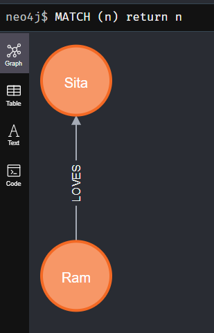
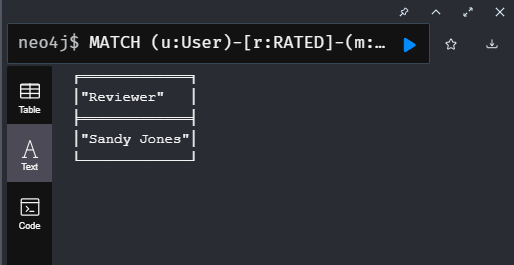
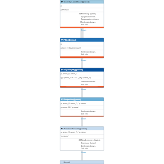

# Neo4j Overview

Neo4j is a native graph database that manages and stores data in a natural and connected state. The term "native" is used because it stores data in a connected state, where each node not only stores its data but also its connections to adjacent nodes. This design enhances search efficiency, particularly when dealing with large databases that may take longer to process complex queries.

Some features:
- Used Cypher query language optimized for propery graph
- Constant time traversals in  big graph for both depth and breadth due to efficient representation of nodes and relationships. Enables scale-up to billions of nodes on moderate hardware.
- Flexible property graph schema that can adapt to bussiness changes, making it possible to materializa and add new relations, property later to shortcut and speed up the domain data

**Cypher** is declarative langugage similar to SQL, but optimized for graphs. It is known for being easy to learn, visual, secure, reliable, data-rich, and open and flexible. 

### Neo4j Browser

Neo4j Browser serves as a robust interface for querying Neo4j and visualizing data results. You can access the interface by connecting to `localhost:7474/browser`.

Neo4j Browser supports all CRUD (Create, Read, Update, Delete) operations, allowing seamless interaction with Neo4j databases using the Cypher language.

### Bolt Protocol

Bolt is the primary protocol used by Neo4j for communication between clients and the Neo4j database server, replacing the earlier HTTP-based protocol. It is a binary protocol designed for efficiency and performance in handling graph database operations.

Features of Bolt Protocol

- **Optimization:** Bolt is optimized for efficiency and performance in graph database operations.
- **Transaction Support:** Bolt supports transactions, enabling clients to execute multiple queries as part of a single transaction. This ensures atomicity and consistency when working with graph data.
- **Port:** The default port for connecting with Neo4j using the Bolt protocol is 7687.

By using the Bolt protocol, Neo4j enhances communication speed and efficiency between clients and the graph database server, providing a more streamlined and effective approach to handling graph data operations.
| Command                  | Description                                                                                       |
|--------------------------|---------------------------------------------------------------------------------------------------|
| `:config`                | Command to see configuration in the browser.                                                     |
| `:play start`            | Initial command run when connected to the Neo4j graph.                                            |
| `:server disconnect`     | Disconnect from Neo4j and clear credentials from the browser's local storage.                      |
| `:server connect`        | Connect to Neo4j.                                                                                |
| `:server status`         | Show metadata for the currently open connection.                                                 |
| `:config {key: value}`   | Change the default configuration in the browser. Sent from `:config` parameters that can be changed.|
| `:play movie`            | Works with dummy data of movies in Neo4j. Requires a BOLT connection to play anything in Neo4j.   |
| `:clear`                 | Remove all frames from the stream.                                                               |
| `:dbs`                   | Show databases available for the current user.                                                    |
| `:guide`                 | Show the guide drawer that contains learning concepts and tools with Neo4j.                       |
| `:params`                | Show all parameters.                                                                             |
| `:params {}`             | Remove all parameters.                                                                           |
| `:sysinfo`               | Show information about Store size, Id Allocation, Page Cache, Transactions, and databases.         |
| `:schema`                | Show information about the database schema, indexes, and constraints.                              |
| `:help <?>`              | Help for different functionality and concepts.                                                    |
|                       | **For more info, refer to the [Browser Manual](https://neo4j.com/docs/browser-manual/current/reference-commands/).**|

### Graph Database Overview
A graph database stores entities as nodes, relationships, and properties instead of using tables or documents. .Rather than employing a tabular format, it can be conceptualized as a whiteboard where data is written and interconnected, visualizing relationships and graphs. **The connection between items are as important as items themselves** This approach allows for a more flexible way of thinking and utilizing data.

Graph databases offer efficient storage and traversal of relationships compared to relational databases, which rely on costly `JOIN` operations. In graph databases, relationships are stored natively with nodes, eliminating the need for complex joins. This native storage enables fast and flexible traversal of data, making it ideal for scenarios where relationships are crucial. Graph databases excel in uncovering hidden relationships between distant items, providing insights into inter-relationships. This functionality is valuable in real-world applications like social networking and mapping, where understanding relationships is paramount.

**Terminologies:**
- **Nodes:** Nodes represent entities in the graph, and they can be labeled to signify different roles in the domain.
  - Nodes can hold any number of key-value pairs (properties), defining their characteristics similar to the attributes of a node.
  - Node labels can include metadata such as constraints and indexes for specific nodes.

- **Relationships:** Relationships establish directed, named connections between node entities (e.g., "Person loves Person").
  - Relationships always have a direction, a type, a start node, and an end node. They can also possess properties similar to nodes.
  - Nodes can have any number of relationships without compromising performance.
#### Model Types

1. **Data Model:**
   - Blueprint of relationships between nodes, defining the schema without containing actual data. Tested against use cases.

2. **Instance Model:**
   - Tested data model with actual data, providing specific node relationships. Contains the data and reflects real-world scenarios.

**Conventions:**
- Nodes represented by circles.
- Labels group nodes into sets, with the same label belonging to the same set. Different labels have distinct colors.
- Node properties follow the camelCase convention.
- Relationships (directed arrows) connect nodes, representing actions. Use relation as `verb` in use cases.
- Relationship names follow the CAPITAL_SNAKE_CASE convention and may have associated properties.

### Neo4J CRUD Operations

#### Create a Node with Property
```cypher
MERGE (:Movie {title: 'Apollo 13', tmdbId: 568, released: '1995-06-30', imdbRating: 7.6, genres: ['Drama', 'Adventure', 'IMAX']})
```

#### Another Example - Update Property of a Node
```cypher
MERGE (u:User {userId: 105})
SET u.name = "RealSanjeev"
```

#### Create Nodes and Relation
```cypher
CREATE (:Person {name: "Ram", age: 32})-[:LOVES]->(:Person {name: "Sita", country: "INDIA"})
```


#### Query - Return all nodes from Graph Database
```cypher
MATCH (n) RETURN n
```
#### Query - Return all Person nodes from Graph Database
```cypher
MATCH (n:Person) RETURN n
```

#### Query - Users Who Gave a Movie a Rating of 5
```cypher
MATCH (u:User)-[r:RATED]-(m:Movie)
WHERE m.title = 'Apollo 13' AND r.rating = 5
RETURN u.name as Reviewer
```
Output: 

#### Delete All Data from Graph Database
```cypher
MATCH (n) DETACH DELETE n;
```

#### Tips and Tricks - Using label(Alias) for Relation Creation
```cypher
MATCH (sandy:User {name: 'Sandy Jones'})
MATCH (apollo:Movie {title: 'Apollo 13'})
MERGE (sandy)-[:RATED {rating:5}]->(apollo)
```


#### Why do you refactor a graph data model and graph?

 - Any of the use cases cannot be answered by the graph.
 - Another use case has been created that needs to be accounted for.
 - The data model does not scale.

#### Reseting after refactor
- Identify which use cases are affected by the refactor.
- REwrite any queries that can take advantage of the refactoring.
- Test all queries affected by the refactor to ensure they return the same results as before the refactoring
- PROFILE 

Profiling the query
```sql
PROFILE MATCH (p:Person)-[:ACTED_IN]-()
WHERE p.born < '1950'
RETURN p.name
```

#### Profiling the Query
```sql
PROFILE MATCH (p:Person)-[:ACTED_IN]-()
WHERE p.born < '1950'
RETURN p.name
```



#### Labeling Practices in Graph Data Model
When creating your graph data model, it's essential to adhere to certain label practices to maintain clarity and efficiency:

- **Moderate Usage:** Labels should be used moderately. Limit the number of labels per node to around four. Excessive labels can clutter the graph and make it challenging to navigate.

- **Avoid Unnecessary Labels:** Adding labels to nodes without a specific use case should be avoided. Labels should serve a purpose in enhancing query performance.

- **Avoid Labeling for Class Hierarchies:** Using labels to represent class hierarchies for your data might lead to unnecessary complexity. It's advisable to structure your model in a way that reflects the natural relationships within your data.

#### Refactoring Duplicates - Language Property
In a large movie dataset, the `Movie` nodes have a property `languages` representing the languages of the movies. As the graph scales, it becomes evident that the `languages` property contains duplicate elements.

To address this, we refactor the graph by creating separate `Language` nodes for each unique language using the `UNWIND` operation:

```sql
MATCH (m:Movie)
UNWIND m.languages AS language
WITH language, collect(m) AS movies
MERGE (l:Language {name: language})
WITH l, movies
UNWIND movies AS m
WITH l, m
MERGE (m)-[:IN_LANGUAGE]->(l);

MATCH (m:Movie)
SET m.languages = null
```

This refactoring allows us to query for movies in a specific language more efficiently:

```sql
MATCH (m:Movie)-[:IN_LANGUAGE]-(l:Language)
WHERE l.name = 'Italian'
RETURN m.title
```

### Refactoring Special Relationship for Improved Efficiency

When dealing with a large number of actors in the graph, traversing all `ACTED_IN` relationships and evaluating movie properties can lead to extensive query processing times, especially in the case of a sizable graph. The query structure `MATCH (n:Actor)-[:ACTED_IN]->(m:Movie)` might result in prolonged evaluation periods, impacting overall performance.

To address this issue, a refactoring approach is introduced to optimize the process. The following command establishes a new set of relationships based on the `released` property's year:

```sql
MATCH (n:Actor)-[:ACTED_IN]->(m:Movie)
CALL apoc.merge.relationship(n,
  'ACTED_IN_' + left(m.released, 4),
  {},
  {},
  m,
  {}
) YIELD rel
RETURN count(*) AS `Number of relationships merged`;
```

This refactoring significantly improves query efficiency by organizing relationships based on the release year. As a result, the evaluation times are reduced, leading to faster query processing for large graphs.

To validate the effectiveness of the refactored query, one can examine the newly created `ACTED_IN_1995` relationship. This targeted query specifically retrieves movies acted by Tom Hanks in 1995 without unnecessary data retrieval, further enhancing query precision.

```sql
MATCH (p:Actor)-[:ACTED_IN_1995]->(m:Movie)
WHERE p.name = 'Tom Hanks'
RETURN m.title AS Movie
```
